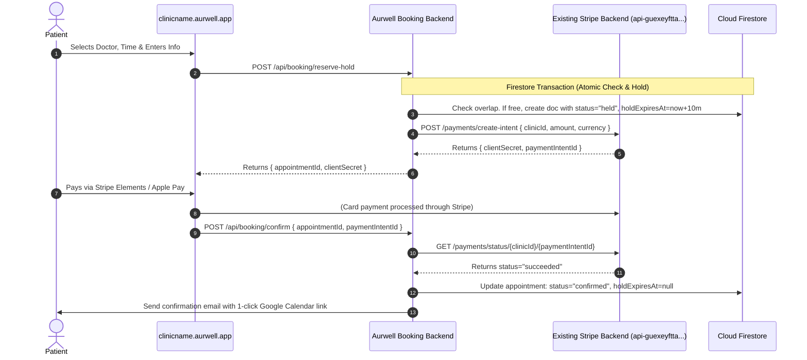

# Aurwell Clinic Booking System — Technical & Functional Specification

## 1. Executive Summary & System Roles

The **Aurwell Clinic Booking System** is a dedicated, high-concurrency booking engine built to power public subdomain portals (`clinicname.aurwell.app`) and patient mobile applications.

### Architectural Boundary & Separation of Concerns:
1. **Existing Admin Panel**:
   - Directly interacts with **Cloud Firestore** using the Firebase Client/Admin SDK.
   - Manages clinic hours, doctor profiles, weekly shifts, date overrides, and manual appointment booking/cancellations directly without requiring an intermediate backend.
2. **Existing Stripe Backend** (`https://api-guexeyftta-uc.a.run.app`):
   - Already deployed and fully functional on Cloud Run.
   - Reused as-is for creating PaymentIntents (`POST /payments/create-intent`), verifying payments (`POST /payments/confirm`), issuing refunds (`POST /payments/refund`), and processing Stripe webhooks.
3. **Dedicated Booking Backend (This Scope)**:
   - Dedicated patient-facing service deployed as **Firebase Cloud Functions (2nd Gen)**.
   - Handles public slot availability calculations, atomic slot reservation holds (10-min locks to prevent race conditions), Stripe payment handoff to the existing Stripe backend, appointment lifecycle confirmation, and automated confirmation emails with Google Calendar links.

---

## 2. Updated Technology Stack & Deployment Architecture

```
                                  ┌─────────────────────────────┐
                                  │      *.aurwell.app          │
                                  │   (Cloudflare Wildcard)     │
                                  └──────────────┬──────────────┘
                                                 │
                                                 ▼
                                  ┌─────────────────────────────┐
                                  │   Public Booking Frontend   │
                                  │   (Next.js App / Mobile)    │
                                  │   clinicname.aurwell.app    │
                                  └──────┬───────────────┬──────┘
                                         │               │
                    Slot Query & Holds   │               │ Direct Public Reads
                                         ▼               ▼
                        ┌─────────────────────────┐  ┌─────────────────────────┐
                        │ Aurwell Booking Backend │  │     Cloud Firestore     │
                        │ (Cloud Functions API)   │  │    (Direct DB Access)   │
                        └──────┬───────────┬──────┘  └───────────▲─────────────┘
                               │           │                     │
      Create / Verify Payment  │           │ Write Confirmed     │ Direct Admin CRUD
                               ▼           │ Appointments & Holds│ (Hours, Doctors,
          ┌───────────────────────────┐    │                     │  Manual Bookings)
          │  Existing Stripe Backend  │    │                     │
          │ api-guexeyftta-uc.a.run   │    │                     │
          └───────────────────────────┘    │                     │
                                           ▼                     │
                              ┌─────────────────────────┐        │
                              │ Send Email Notification │        │
                              │ (Google Calendar Link)  │        │
                              └─────────────────────────┘        │
                                                                 │
                                                    ┌────────────┴────────────┐
                                                    │   Aurwell Admin Panel   │
                                                    │  (Existing Next.js App) │
                                                    └─────────────────────────┘
```

---

## 3. Booking Backend Responsibilities & API Endpoints

The dedicated Booking Backend exposes lightweight, fast endpoints tailored for patient booking:

### 3.1. `POST /api/booking/available-slots`
Calculates available bookable start times for a specific treatment, doctor (or any doctor), and date.
- **Input**: `{ clinicId, treatmentId, doctorId (optional), date: "YYYY-MM-DD" }`
- **Logic**:
  1. Fetches clinic operating hours and checks date overrides.
  2. Fetches active doctors qualified for `treatmentId` and their specific working shifts.
  3. Fetches blocked slots/leaves and existing appointments (`status == "confirmed"` OR active `"held"` slots where `holdExpiresAt > now`).
  4. Computes free time windows matching `treatment.durationMinutes + treatment.bufferMinutes`.
- **Output**:
```json
{
  "date": "2026-09-18",
  "clinicId": "clinic_123",
  "treatment": {
    "id": "treat_01",
    "title": "HydraFacial Deluxe",
    "durationMinutes": 45,
    "price": 180
  },
  "slots": [
    { "time": "09:00", "doctorIds": ["doc_01", "doc_02"] },
    { "time": "09:45", "doctorIds": ["doc_01"] },
    { "time": "10:30", "doctorIds": ["doc_02"] }
  ]
}
```

---

### 3.2. `POST /api/booking/reserve-hold`
Atomically holds a slot for 10 minutes during the patient's checkout flow to prevent double booking.
- **Input**:
```json
{
  "clinicId": "clinic_123",
  "treatmentId": "treat_01",
  "variantTitle": "Full Face",
  "doctorId": "doc_01",
  "startDateTime": "2026-09-18T10:00:00Z",
  "patient": {
    "name": "Sarah Miller",
    "email": "sarah.miller@example.com",
    "phone": "+44 7700 900123",
    "notes": "Sensitive skin"
  }
}
```
- **Execution**:
  1. Opens a **Firestore Transaction**.
  2. Validates that no overlapping `confirmed` appointment or active `held` appointment exists for `doc_01` during the window $[T_{start}, T_{end} + \text{buffer}]$.
  3. If occupied: returns `409 Conflict` ("Slot just taken, please select another time").
  4. If free: creates a new document in `/clinics/{clinicId}/appointments/{appointmentId}` with:
     - `status`: `"held"`
     - `holdExpiresAt`: `Timestamp.now() + 10 minutes`
  5. If clinic requires payment: Calls the **Existing Stripe Backend** (`POST https://api-guexeyftta-uc.a.run.app/payments/create-intent`) using the clinic's Stripe credentials.
- **Output**:
```json
{
  "appointmentId": "apt_20260918_8841",
  "holdExpiresAt": "2026-09-10T22:01:36Z",
  "paymentRequired": true,
  "payment": {
    "clientSecret": "pi_3Ty7..._secret_xyz123",
    "paymentIntentId": "pi_3Ty7...",
    "amount": 90.0,
    "currency": "GBP"
  }
}
```

---

### 3.3. `POST /api/booking/confirm`
Finalizes the appointment after the client completes the payment or if no payment is required.
- **Input**:
```json
{
  "clinicId": "clinic_123",
  "appointmentId": "apt_20260918_8841",
  "paymentIntentId": "pi_3Ty7..." // optional if free
}
```
- **Execution**:
  1. If payment was required, verifies status with the **Existing Stripe Backend** (`GET /payments/status/{clinicId}/{paymentIntentId}`).
  2. Updates the Firestore document:
     - `status`: `"confirmed"`
     - `holdExpiresAt`: `null`
     - `payment.status`: `"paid"`
  3. Dispatches the confirmation email with the **Google Calendar 1-Click Link** and `.ics` attachment.
- **Output**:
```json
{
  "success": true,
  "appointmentId": "apt_20260918_8841",
  "status": "confirmed",
  "calendarLink": "https://calendar.google.com/calendar/render?action=TEMPLATE&..."
}
```

---

### 3.4. `POST /api/booking/cancel` (Patient Self-Service)
Allows patients to cancel appointments within the clinic's allowable cancellation window (`cancellationHours`).
- **Input**: `{ clinicId, appointmentId, email, cancelReason }`
- **Execution**:
  1. Validates cancellation policy (`appointment.startDateTime - now > clinic.cancellationHours`).
  2. Updates `status: "cancelled"`.
  3. If refundable: Calls Existing Stripe Backend (`POST /payments/refund`).
  4. Sends cancellation notification email.

---

### 3.5. Scheduled Maintenance: `cleanupExpiredHolds`
A lightweight Pub/Sub scheduled function running every 5 minutes:
- Queries `/clinics/{clinicId}/appointments` where `status == "held"` and `holdExpiresAt < now()`.
- Updates `status: "expired"`, releasing the slot for other patients.

---

## 4. Clinic Multi-Tenancy & External Booking Flags

On the `/clinics/{clinicId}` document in Firestore, the admin panel directly configures the `bookingConfig` object:

```json
{
  "bookingConfig": {
    "systemType": "aurwell_custom", // "aurwell_custom" | "external_sdk" | "disabled"
    "subdomain": "harleystreet",     // powers harleystreet.aurwell.app
    "customDomain": null,            // optional e.g. booking.harleystreet.com
    "externalBooking": {
      "provider": "fresha",          // "fresha" | "phorest" | "custom_link"
      "url": "https://fresha.com/a/example-clinic"
    },
    "settings": {
      "requirePaymentUpfront": true,
      "depositType": "percentage",   // "full" | "percentage" | "fixed"
      "depositAmount": 50,           // 50% deposit
      "slotIntervalMinutes": 15,
      "minNoticeHours": 2,
      "maxAdvanceDays": 60,
      "cancellationHours": 24,
      "holdDurationMinutes": 10
    }
  }
}
```

### Behavior by `systemType`:
- **`aurwell_custom`**: Subdomain renders the native Aurwell multi-step booking wizard (Treatment $\rightarrow$ Doctor $\rightarrow$ Slot $\rightarrow$ Details $\rightarrow$ Stripe Pay).
- **`external_sdk`**: Subdomain automatically loads or redirects to the clinic's third-party widget (e.g., Fresha / Phorest).
- **`disabled`**: Subdomain displays a branded contact/inquiry page stating online booking is currently unavailable.

---

## 5. Firestore Database Structure (`FIREBASE_SCHEMA.md` Extensions)

All subcollections are directly under `/clinics/{clinicId}`:

```
/clinics (root collection)
    └── {clinicId} (clinic config document)
         ├── /treatments/{treatmentId}        (Add durationMinutes, bufferMinutes)
         ├── /doctors/{doctorId}              (Doctor profiles & qualifications)
         ├── /schedules/operating_hours       (Clinic weekly hours & date overrides)
         ├── /schedules/doctor_{doctorId}     (Doctor weekly shifts)
         ├── /blocked_slots/{slotId}          (Leaves, holidays, breaks)
         └── /appointments/{appointmentId}    (Appointments & active holds)

/subdomains (root lookup collection)
    └── {subdomain}                          (Maps "harleystreet" -> "clinic_dxwk70NNVXdI05ftD9CuHmuZ5212")
```

### 5.1. Doctor Document Schema (`/clinics/{clinicId}/doctors/{doctorId}`)
Managed directly by Admin Panel:

| Field | Type | Description |
|---|---|---|
| `doctorId` | `string` | Unique doctor identifier |
| `name` | `string` | Doctor full name (e.g. `"Dr. Sarah Jenkins"`) |
| `title` | `string` | Designation / Specialty (e.g. `"Aesthetic Doctor"`) |
| `email` | `string` | Doctor contact & notification email |
| `phone` | `string` | Contact phone |
| `avatarUrl` | `string` | Profile image URL |
| `bio` | `string` | Short practitioner biography |
| `assignedTreatments` | `array` of `string` | Treatment IDs this doctor performs (or `["all"]`) |
| `isActive` | `boolean` | Toggle active status |
| `createdAt` | `timestamp` | Creation timestamp |

---

### 5.2. Clinic Operating Hours & Overrides (`/clinics/{clinicId}/schedules/operating_hours`)
Managed directly by Admin Panel:

```json
{
  "weeklyHours": {
    "monday":    { "isOpen": true,  "slots": [{ "start": "09:00", "end": "17:00" }] },
    "tuesday":   { "isOpen": true,  "slots": [{ "start": "09:00", "end": "17:00" }] },
    "wednesday": { "isOpen": true,  "slots": [{ "start": "09:00", "end": "17:00" }] },
    "thursday":  { "isOpen": true,  "slots": [{ "start": "09:00", "end": "20:00" }] },
    "friday":    { "isOpen": true,  "slots": [{ "start": "09:00", "end": "17:00" }] },
    "saturday":  { "isOpen": true,  "slots": [{ "start": "10:00", "end": "16:00" }] },
    "sunday":    { "isOpen": false, "slots": [] }
  },
  "dateOverrides": [
    {
      "date": "2026-12-25",
      "isClosed": true,
      "reason": "Christmas Day"
    },
    {
      "date": "2026-12-31",
      "isClosed": false,
      "slots": [{ "start": "09:00", "end": "13:00" }],
      "reason": "New Year's Eve Early Closure"
    }
  ]
}
```

---

### 5.3. Doctor Working Shifts (`/clinics/{clinicId}/schedules/doctor_{doctorId}`)
Managed directly by Admin Panel:

```json
{
  "doctorId": "doc_8231",
  "weeklyHours": {
    "monday":    { "isWorking": true,  "shifts": [{ "start": "09:00", "end": "13:00" }, { "start": "14:00", "end": "17:00" }] },
    "tuesday":   { "isWorking": true,  "shifts": [{ "start": "09:00", "end": "17:00" }] },
    "wednesday": { "isWorking": false, "shifts": [] },
    "thursday":  { "isWorking": true,  "shifts": [{ "start": "12:00", "end": "20:00" }] },
    "friday":    { "isWorking": true,  "shifts": [{ "start": "09:00", "end": "17:00" }] },
    "saturday":  { "isWorking": false, "shifts": [] },
    "sunday":    { "isWorking": false, "shifts": [] }
  }
}
```

---

### 5.4. Appointment Document Schema (`/clinics/{clinicId}/appointments/{appointmentId}`)
Written by Booking Backend & Admin Panel:

```json
{
  "appointmentId": "apt_20260918_8841",
  "clinicId": "clinic_dxwk70NNVXdI05ftD9CuHmuZ5212",
  "doctorId": "doc_8231",
  "doctorName": "Dr. Sarah Jenkins",
  "patient": {
    "patientId": "pat_9921",
    "name": "Sarah Miller",
    "email": "sarah.miller@example.com",
    "phone": "+44 7700 900123",
    "notes": "Sensitive skin, allergic to latex"
  },
  "treatment": {
    "treatmentId": "treat_01",
    "title": "HydraFacial Deluxe",
    "variantTitle": "Full Face & Neck",
    "price": 180,
    "durationMinutes": 45,
    "bufferMinutes": 15
  },
  "schedule": {
    "startDateTime": "2026-09-18T10:00:00Z",
    "endDateTime": "2026-09-18T10:45:00Z",
    "slotEndDateTimeWithBuffer": "2026-09-18T11:00:00Z",
    "timezone": "Europe/London"
  },
  "status": "confirmed",
  "bookingSource": "public_web",
  "holdExpiresAt": null,
  "payment": {
    "required": true,
    "status": "paid",
    "amountPaid": 90,
    "depositType": "percentage",
    "currency": "GBP",
    "stripePaymentIntentId": "pi_3MtwBwLkdIwHu7ix28a3tqPa"
  },
  "createdAt": "2026-09-10T21:44:00Z",
  "updatedAt": "2026-09-10T21:44:00Z"
}
```

---

## 6. Payment Flow with Existing Stripe Backend



---

## 7. Automated Email & 1-Click Google Calendar Link

Upon confirmation, an email is dispatched containing:
- Clinic name, address, doctor, treatment, variant, and date/time.
- **Direct 1-Click Google Calendar URL**:
```
https://calendar.google.com/calendar/render?action=TEMPLATE&text=HydraFacial+Deluxe+with+Dr.+Sarah+Jenkins&dates=20260918T100000Z/20260918T104500Z&details=Booking+ID:+apt_20260918_8841%0AClinic:+Lumière+Aesthetics%0APhone:+%2B44+20+7946+0813&location=47+Harley+Street,+Marylebone
```
- Standard `.ics` iCalendar attachment for iOS / Apple Calendar and Outlook.
