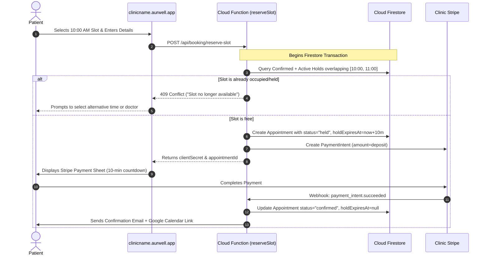

# Aurwell Clinic Booking System — Technical & Functional Specification

## 1. Executive Summary & Objectives

The **Aurwell Clinic Booking System** is a multi-tenant booking engine built on top of the existing Aurwell Firebase backend. It allows each clinic to operate an isolated scheduling, staff, and appointment system, while offering patients a seamless, white-labeled booking portal accessible via unique subdomains (`clinicname.aurwell.app`).

### Key Capabilities:
- **Tenant Isolation & Flexibility**: Support for clinics with Aurwell's native booking engine, external booking SDKs/links (e.g., Fresha, Phorest), or disabled booking.
- **Operating Hours & Date Overrides**: Flexible weekly operating hours with holiday/closure date overrides.
- **Doctor / Staff Availability**: Independent doctor shifts, break periods, and leave calendars.
- **Treatment Durations & Buffers**: Individual service durations and post-treatment room recovery/prep buffers.
- **Concurrency & Double-Booking Prevention**: Distributed slot locking with a temporary 10-minute hold window during checkout.
- **Reused Stripe Infrastructure**: Direct integration with each clinic's existing Stripe credentials for upfront deposits or full payments.
- **Automated Notifications**: Instant confirmation emails with 1-click Google Calendar / ICS calendar integration.

---

## 2. Technology Stack & Deployment Architecture

```
                                  ┌─────────────────────────────┐
                                  │      *.aurwell.app          │
                                  │   (Cloudflare Wildcard)     │
                                  └──────────────┬──────────────┘
                                                 │
                                                 ▼
                                  ┌─────────────────────────────┐
                                  │     Next.js Application     │
                                  │   (Subdomain Middleware)    │
                                  └──────┬───────────────┬──────┘
                                         │               │
                     ┌───────────────────┘               └───────────────────┐
                     ▼                                                       ▼
        ┌─────────────────────────┐                             ┌─────────────────────────┐
        │  Public Booking Portal  │                             │   Admin Panel Portal    │
        │ clinicname.aurwell.app  │                             │    admin.aurwell.app    │
        └────────────┬────────────┘                             └────────────┬────────────┘
                     │                                                       │
                     └───────────────────┬───────────────────────────────────┘
                                         ▼
                          ┌─────────────────────────────┐
                          │   Firebase Cloud Functions  │
                          │   (Node.js 20 / TypeScript) │
                          └──────────────┬──────────────┘
                                         │
                 ┌───────────────────────┼───────────────────────┐
                 ▼                       ▼                       ▼
      ┌─────────────────────┐ ┌─────────────────────┐ ┌─────────────────────┐
      │   Cloud Firestore   │ │  Clinic Stripe API  │ │  Email Dispatcher   │
      │  (Atomic Locks & DB)│ │ (Payments/Webhooks) │ │ (Resend / SendGrid) │
      └─────────────────────┘ └─────────────────────┘ └─────────────────────┘
```

### Stack Components:
1. **Frontend (Public Portal & Admin Panel)**: Next.js (App Router) with TypeScript and Tailwind CSS. Next.js middleware extracts the hostname/subdomain to dynamically load the clinic tenant context.
2. **Backend & Booking Engine**: Firebase Cloud Functions (2nd Gen) providing secure REST/Callable endpoints for slot calculations, reservation holds, Stripe payment intents, and cancellation logic.
3. **Database**: Cloud Firestore (NoSQL) utilizing atomic transactions (`runTransaction`) for race-condition prevention.
4. **Payments**: Stripe Connect / Direct Tenant Stripe credentials already configured in `/clinics/{clinicId}`.
5. **Transactional Emails**: SendGrid, Resend, or Firebase Trigger Email extension with dynamic Google Calendar deep links and `.ics` file generation.

---

## 3. Database Schema Specifications (`FIREBASE_SCHEMA.md` Extensions)

### 3.1. Clinic Tenant Root Extension (`/clinics/{clinicId}`)

Add the `bookingConfig` object to the clinic document:

```json
{
  "bookingConfig": {
    "systemType": "aurwell_custom",
    "subdomain": "harleystreet",
    "customDomain": null,
    "externalBooking": {
      "provider": "fresha",
      "url": "https://fresha.com/a/example-clinic"
    },
    "settings": {
      "requirePaymentUpfront": true,
      "depositType": "percentage",
      "depositAmount": 50,
      "slotIntervalMinutes": 15,
      "minNoticeHours": 2,
      "maxAdvanceDays": 60,
      "cancellationHours": 24,
      "holdDurationMinutes": 10
    }
  }
}
```

| Field Path | Type | Description |
|---|---|---|
| `bookingConfig.systemType` | `string` | Mode: `"aurwell_custom"`, `"external_sdk"`, or `"disabled"` |
| `bookingConfig.subdomain` | `string` | Unique subdomain prefix (e.g. `"harleystreet"`) |
| `bookingConfig.customDomain` | `string \| null` | Optional custom domain (e.g. `"booking.harleystreet.com"`) |
| `bookingConfig.externalBooking.provider`| `string` | External provider name (e.g. `"fresha"`, `"phorest"`, `"custom_link"`) |
| `bookingConfig.externalBooking.url` | `string` | External booking URL to redirect patients to |
| `bookingConfig.settings.requirePaymentUpfront` | `boolean` | Whether payment/deposit is required at checkout |
| `bookingConfig.settings.depositType` | `string` | `"full"`, `"percentage"`, or `"fixed"` |
| `bookingConfig.settings.depositAmount` | `number` | Amount in currency or percentage |
| `bookingConfig.settings.slotIntervalMinutes` | `number` | Step interval for available slot generation (default: `15`) |
| `bookingConfig.settings.minNoticeHours` | `number` | Minimum hours before booking time (default: `2`) |
| `bookingConfig.settings.maxAdvanceDays` | `number` | Maximum days into the future patients can book (default: `60`) |
| `bookingConfig.settings.cancellationHours` | `number` | Free cancellation window in hours (default: `24`) |
| `bookingConfig.settings.holdDurationMinutes` | `number` | Temporary reservation lock duration (default: `10`) |

---

### 3.2. Subdomain Lookup Root Collection (`/subdomains/{subdomain}`)
Fast O(1) tenant lookup for public requests.

- **Path**: `/subdomains/{subdomain}`
- **Document ID**: `subdomain` (e.g. `harleystreet`)

```json
{
  "clinicId": "clinic_ownerUid123",
  "subdomain": "harleystreet",
  "isActive": true,
  "createdAt": "2026-09-10T21:44:00Z"
}
```

---

### 3.3. Treatment Enhancements (`/clinics/{clinicId}/treatments/{treatmentId}`)

Add duration and scheduling parameters to existing treatment records:

| Field | Type | Description |
|---|---|---|
| `durationMinutes` | `number` | Treatment duration in minutes (e.g. `45`) |
| `bufferMinutes` | `number` | Post-treatment cleaning/prep time in minutes (e.g. `15`) |
| `depositRequired` | `boolean \| null` | Optional treatment-level deposit override |

---

### 3.4. Doctors Subcollection (`/clinics/{clinicId}/doctors/{doctorId}`)

Stores doctor profiles, qualifications, and active statuses.

- **Path**: `/clinics/{clinicId}/doctors/{doctorId}`
- **Document ID**: Auto-generated (`doc_...`)

```json
{
  "doctorId": "doc_8231",
  "name": "Dr. Sarah Jenkins",
  "title": "Senior Aesthetic Practitioner",
  "email": "dr.jenkins@harleystreet.com",
  "phone": "+44 20 7946 0999",
  "avatarUrl": "https://firebasestorage.googleapis.com/.../avatar.jpg",
  "bio": "Specialist in non-surgical facial rejuvenation with 12+ years experience.",
  "assignedTreatments": ["treatment_01", "treatment_02"],
  "allTreatments": false,
  "isActive": true,
  "createdAt": "2026-09-10T21:44:00Z",
  "updatedAt": "2026-09-10T21:44:00Z"
}
```

---

### 3.5. Schedules & Hours (`/clinics/{clinicId}/schedules/{scheduleId}`)

#### Clinic Operating Hours Doc ID: `operating_hours`
- **Path**: `/clinics/{clinicId}/schedules/operating_hours`

```json
{
  "weeklyHours": {
    "monday":    { "isOpen": true,  "slots": [{ "start": "09:00", "end": "17:00" }] },
    "tuesday":   { "isOpen": true,  "slots": [{ "start": "09:00", "end": "17:00" }] },
    "wednesday": { "isOpen": true,  "slots": [{ "start": "09:00", "end": "17:00" }] },
    "thursday":  { "isOpen": true,  "slots": [{ "start": "09:00", "end": "20:00" }] },
    "friday":    { "isOpen": true,  "slots": [{ "start": "09:00", "end": "17:00" }] },
    "saturday":  { "isOpen": true,  "slots": [{ "start": "10:00", "end": "16:00" }] },
    "sunday":    { "isOpen": false, "slots": [] }
  },
  "dateOverrides": [
    {
      "date": "2026-12-25",
      "isClosed": true,
      "reason": "Christmas Day"
    },
    {
      "date": "2026-12-31",
      "isClosed": false,
      "slots": [{ "start": "09:00", "end": "13:00" }],
      "reason": "New Year's Eve Early Closure"
    }
  ]
}
```

#### Doctor Working Shifts Doc ID: `doctor_{doctorId}`
- **Path**: `/clinics/{clinicId}/schedules/doctor_{doctorId}`

```json
{
  "doctorId": "doc_8231",
  "weeklyHours": {
    "monday":    { "isWorking": true,  "shifts": [{ "start": "09:00", "end": "13:00" }, { "start": "14:00", "end": "17:00" }] },
    "tuesday":   { "isWorking": true,  "shifts": [{ "start": "09:00", "end": "17:00" }] },
    "wednesday": { "isWorking": false, "shifts": [] },
    "thursday":  { "isWorking": true,  "shifts": [{ "start": "12:00", "end": "20:00" }] },
    "friday":    { "isWorking": true,  "shifts": [{ "start": "09:00", "end": "17:00" }] },
    "saturday":  { "isWorking": false, "shifts": [] },
    "sunday":    { "isWorking": false, "shifts": [] }
  }
}
```

---

### 3.6. Blocked Slots & Leaves (`/clinics/{clinicId}/blocked_slots/{slotId}`)

- **Path**: `/clinics/{clinicId}/blocked_slots/{slotId}`
- **Document ID**: Auto-generated (`block_...`)

```json
{
  "id": "block_4921",
  "doctorId": "doc_8231",
  "scope": "doctor",
  "startDateTime": "2026-10-10T09:00:00Z",
  "endDateTime": "2026-10-15T18:00:00Z",
  "type": "leave",
  "reason": "Annual Leave / Conference",
  "createdAt": "2026-09-10T21:44:00Z"
}
```

---

### 3.7. Appointments Subcollection (`/clinics/{clinicId}/appointments/{appointmentId}`)

- **Path**: `/clinics/{clinicId}/appointments/{appointmentId}`
- **Document ID**: Auto-generated or prefixed (`apt_...`)

```json
{
  "appointmentId": "apt_20260910_8841",
  "clinicId": "clinic_ownerUid123",
  "doctorId": "doc_8231",
  "doctorName": "Dr. Sarah Jenkins",
  "patient": {
    "patientId": "pat_9921",
    "name": "Sarah Miller",
    "email": "sarah.miller@example.com",
    "phone": "+44 7700 900123",
    "notes": "Sensitive skin, allergic to latex"
  },
  "treatment": {
    "treatmentId": "treat_01",
    "title": "HydraFacial Deluxe",
    "variantTitle": "Full Face & Neck",
    "price": 180,
    "durationMinutes": 45,
    "bufferMinutes": 15
  },
  "schedule": {
    "startDateTime": "2026-09-18T10:00:00Z",
    "endDateTime": "2026-09-18T10:45:00Z",
    "slotEndDateTimeWithBuffer": "2026-09-18T11:00:00Z",
    "timezone": "Europe/London"
  },
  "status": "confirmed",
  "bookingSource": "public_web",
  "holdExpiresAt": null,
  "payment": {
    "required": true,
    "status": "paid",
    "amountPaid": 90,
    "depositType": "percentage",
    "currency": "GBP",
    "stripePaymentIntentId": "pi_3MtwBwLkdIwHu7ix28a3tqPa",
    "stripeCustomerId": "cus_991823",
    "transactionId": "tx_1721669800000_abc"
  },
  "cancellation": {
    "isCancelled": false,
    "cancelledAt": null,
    "cancelledBy": null,
    "reason": null
  },
  "createdAt": "2026-09-10T21:44:00Z",
  "updatedAt": "2026-09-10T21:44:00Z"
}
```

---

## 4. Availability Engine & Concurrency Algorithm

### 4.1. Slot Computation Formula

A time slot $[T_{start}, T_{end}]$ is available if and only if **all** of the following conditions are met:

$$\text{Slot Available} = (T \subseteq \text{Clinic Hours}) \land (T \subseteq \text{Doctor Shifts}) \land (T \cap \text{Date Overrides} = \emptyset) \land (T \cap \text{Doctor Leaves} = \emptyset) \land (T \cap \text{Existing Bookings} = \emptyset)$$

Where $\text{Existing Bookings}$ includes:
1. All appointments with `status == "confirmed"`.
2. All appointments with `status == "held"` where `holdExpiresAt > now()`.

```
                    ┌──────────────────────────────┐
                    │      Clinic Open Hours       │
                    └──────────────┬───────────────┘
                                   │ INTERSECT
                                   ▼
                    ┌──────────────────────────────┐
                    │     Doctor Working Shift     │
                    └──────────────┬───────────────┘
                                   │ SUBTRACT
                                   ▼
                    ┌──────────────────────────────┐
                    │   Clinic Holidays/Overrides  │
                    └──────────────┬───────────────┘
                                   │ SUBTRACT
                                   ▼
                    ┌──────────────────────────────┐
                    │   Doctor Leaves & Breaks     │
                    └──────────────┬───────────────┘
                                   │ SUBTRACT
                                   ▼
                    ┌──────────────────────────────┐
                    │ Confirmed & Active Holds     │
                    └──────────────┬───────────────┘
                                   │
                                   ▼
                    [ List of Bookable Start Times ]
```

---

### 4.2. Double-Booking Prevention (Atomic Reservation Protocol)

To eliminate race conditions when two patients select the same slot simultaneously:



---

## 5. Appointment State Machine

```
               ┌───────────────┐
               │    Held       │ (10-minute temporary checkout lock)
               └───────┬───────┘
                       │
         ┌─────────────┴─────────────┐
         │ (Payment Success / Staff) │ (Payment Failed / Abandoned / Timeout)
         ▼                           ▼
  ┌───────────────┐           ┌───────────────┐
  │   Confirmed   │           │    Expired    │
  └───────┬───────┘           └───────────────┘
          │
  ┌───────┼───────────────────────────┐
  │       │                           │
  ▼       ▼                           ▼
┌───────────┐ ┌───────────┐     ┌───────────┐
│ Completed │ │ Cancelled │     │  No-Show  │
└───────────┘ └───────────┘     └───────────┘
```

| Status | Description |
|---|---|
| `held` | Temporarily reserved while patient completes checkout (expires in 10 minutes). |
| `confirmed` | Payment completed (or booked internally by staff). Slot is booked. |
| `completed` | Patient arrived and received treatment. |
| `cancelled` | Cancelled by patient or clinic staff (triggers refund if applicable). |
| `no_show` | Patient failed to attend appointment. |
| `expired` | Patient abandoned checkout session or payment failed. Slot freed automatically. |

---

## 6. Email Notifications & Google Calendar Deep Link

### 6.1. Google Calendar 1-Click Link Format
```
https://calendar.google.com/calendar/render?action=TEMPLATE&text={TreatmentName}+at+{ClinicName}&dates={StartUtcISO}/{EndUtcISO}&details={Details}&location={ClinicAddress}
```

**Example Parameters:**
- `text`: `HydraFacial Deluxe with Dr. Sarah Jenkins`
- `dates`: `20260918T100000Z/20260918T104500Z`
- `details`: `Booking ID: apt_20260910_8841\nClinic: Harley Street Clinic\nDoctor: Dr. Sarah Jenkins\nAddress: 10 Harley St, London W1G 9PF`
- `location`: `10 Harley St, London W1G 9PF`

### 6.2. `.ics` iCalendar Attachment
Along with the Google Calendar link, an `.ics` attachment is included in the confirmation email for 1-click import into Apple Calendar and Microsoft Outlook.

---

## 7. Implementation Plan

| Phase | Deliverables |
|---|---|
| **Phase 1: Schema & Rules** | • Update `FIREBASE_SCHEMA.md` with `/doctors`, `/schedules`, `/blocked_slots`, `/appointments`, and `bookingConfig`.<br>• Update `firestore.rules` for secure tenant access. |
| **Phase 2: Booking Cloud Functions** | • `getAvailableSlots`: Calculates dynamic bookable slots based on doctor + clinic schedules.<br>• `reserveSlot`: Atomic Firestore transaction holding slot for 10 minutes.<br>• `confirmBookingWebhook`: Handles Stripe webhooks to confirm appointments.<br>• `cleanupExpiredHolds`: Scheduled Cloud Function to release abandoned holds. |
| **Phase 3: Admin Panel Module** | • Doctor Profile Management.<br>• Weekly Working Hours & Holiday Overrides UI.<br>• Interactive Appointments Calendar (Day / Week / Month views).<br>• Manual Booking / Reschedule / Cancel modal. |
| **Phase 4: Public Booking App (`*.aurwell.app`)** | • Multi-tenant Subdomain Routing Middleware.<br>• 4-Step Booking Wizard (Treatment $\rightarrow$ Doctor $\rightarrow$ Date/Time $\rightarrow$ Details & Stripe Checkout).<br>• Booking Confirmation Page + Email Dispatch + Google Calendar link. |
